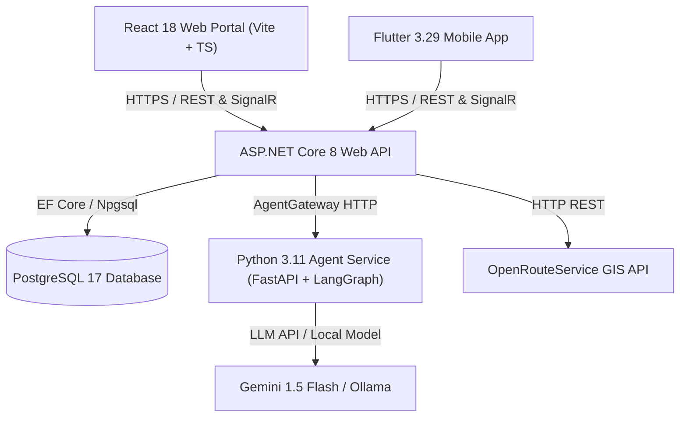
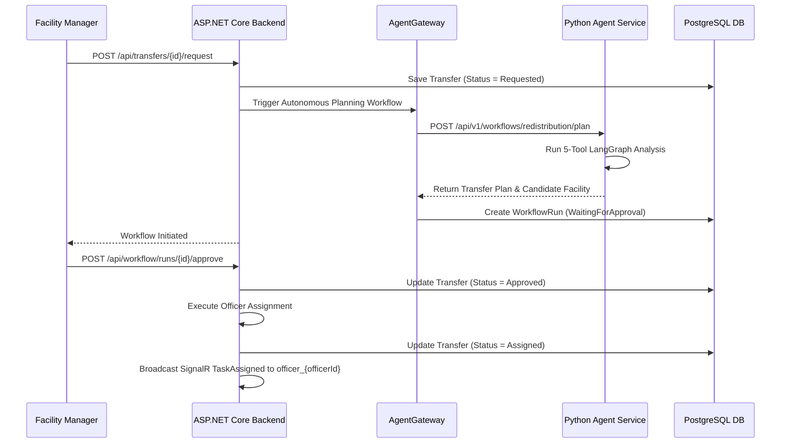

# MediStock — AI-Powered Pharmaceutical Inventory & Supply Chain Platform

## 1. Project Overview

**MediStock** is an enterprise-grade, facility-to-facility pharmaceutical inventory management, shortage forecasting, supply redistribution, and procurement coordination platform. Built for regional hospital networks, central medical stores, and retail/field dispensaries, MediStock integrates deterministic business logic with autonomous Agentic AI to automate supply chain handoffs and balance medicine availability across facilities.

The system combines a multi-role **ASP.NET Core 8 Web API** backend, a **PostgreSQL 17** relational database, an internal **Python 3.11 / LangGraph / FastAPI** Agentic AI microservice, a **React 18 / TypeScript** web management portal, and a **Flutter 3.29 / Dart 3.7** mobile field application.

---

## 2. Business Problem

Pharmaceutical supply chains in regional healthcare networks face severe operational bottlenecks:
- **Unpredicted Stockouts**: Manual monitoring of medicine consumption leads to abrupt stockouts of essential life-saving drugs before reorders are initiated.
- **Stock Imbalance**: Surplus stock at central depots or urban hospitals remains underutilized while rural dispensaries experience critical shortages.
- **Manual Handoff Overhead**: Coordinating stock redistribution and creating procurement purchase orders requires fragmented communication between storekeepers, facility managers, and procurement officers.
- **Cold-Chain & Policy Violations**: Manual transfer requests often overlook temperature compliance rules, shelf-life thresholds, or safety stock requirements.

MediStock solves these challenges by continuously monitoring inventory balances, forecasting demand, automatically proposing inter-facility transfers, routing officer pickup tasks via real-time SignalR notifications, and converting rejected transfers into automated procurement replenishment workflows.

---

## 3. Objectives

- **Automated Shortage Detection**: Continuously compute historical daily burn rates, project stockout timelines, and raise automated shortage alerts.
- **AI-Driven Redistribution Planning**: Evaluate candidate supply facilities using geographical proximity, surplus capacity, and route calculation (via OpenRouteService with Haversine fallback) to generate transfer proposals.
- **Closed-Loop Workflow Handoffs**:
  - **Path A (Approval)**: On manager approval, assign an available field officer, stream SignalR `TaskAssigned` notifications, and track task acceptance/dispatch/delivery.
  - **Path B (Rejection)**: On manager rejection, generate a `ReplenishmentRequest` and trigger procurement purchase order workflows.
- **Deterministic Business Governance**: Enforce strict backend validation rules on all inventory mutations, stock reservations, safety stock limits, and policy compliance before executing any AI-proposed action.

---

## 4. Scope

The current implementation covers four core operational domains:
1. **Medicine & Facility Inventory**: Batch-level tracking, DataMatrix barcode scanning support, inventory balance adjustments, stock reservations, and 90-day expiry risk monitoring.
2. **Demand & Shortage Monitoring**: Daily consumption logging, exponential smoothing & moving average demand forecasting, and automated shortage alert lifecycle management.
3. **Redistribution Management**: Multi-facility transfer planning, candidate facility ranking, GIS transit routing, SignalR field officer dispatch, and operational delivery verification.
4. **Procurement & Policy Validation**: Supplier registry, purchase order creation/fulfillment, replenishment request queue management, and policy compliance auditing.

---

## 5. Key Features

- **Multi-Role Authentication & Access Control**: JWT-based access with refresh tokens and role-based policy enforcement across 5 roles (`STORE_OFFICER`, `FACILITY_MANAGER`, `FIELD_OFFICER`, `SUPPLIER_OFFICER`, `ADMIN`).
- **Real-Time SignalR Broadcasts**: Live WebSocket notifications for transfer status changes, field officer task assignments, location updates, and replenishment requests via `TransferHub`.
- **Autonomous Agentic AI Planning**: Python LangGraph agent executing 5 specialized tools (`getCandidateFacilities`, `getFacilityInventory`, `getFacilityLocation`, `calculateDistance`, `calculateTransferQuantity`) to formulate redistribution plans.
- **DataMatrix Scanner Integration**: Flutter mobile scanning support with camera/hardware integration and fallback manual batch entry for stock lookup and receipt verification.
- **Resilient GIS Transit Routing**: `RoutingService` incorporating OpenRouteService road routing with fallback to Haversine distance and duration estimates.
- **Comprehensive Audit Trail**: Automated status history logging (`TransferStatusHistory`) and system transaction audit logs for supply chain compliance.

---

## 6. User Roles and Permissions

| Role Name | Internal Code | Accessible Operations & Scope |
| :--- | :--- | :--- |
| **Store Officer** | `STORE_OFFICER` / `OperationalStaff` | Receive stock, create medicine batches, log daily consumption, perform stock adjustments, inspect facility inventory balances. |
| **Facility Manager** | `FACILITY_MANAGER` / `FacilityManager` | Approve/reject redistribution workflow runs, review candidate facilities, create/approve transfer requests, oversee shortage alerts, generate POs from replenishment requests. |
| **Field Officer** | `FIELD_OFFICER` / `FieldOfficer` | Receive real-time `TaskAssigned` SignalR notifications, view task details (pickup/delivery locations, line items, distance), Accept/Decline transfer tasks, stream GPS location updates, verify physical deliveries. |
| **Supplier Officer** | `SUPPLIER_OFFICER` / `SupplierOfficer` | View assigned purchase orders, update PO fulfillment status, manage supplier catalog information. |
| **Administrator** | `ADMIN` / `Administrator` | Full system access across all facilities, user management, system audit log inspection, global configuration. |

---

## 7. System Architecture

MediStock follows a decoupled, multi-tier architecture adhering to clean architecture principles:



- **Architectural Rules**:
  - ASP.NET Core is the authoritative backend for business rules, validation, and database access.
  - PostgreSQL is the single system source of truth.
  - React and Flutter clients connect strictly to ASP.NET Core and never directly to the Python Agent Service.
  - The Python Agent Service is internal, stateless, and accessed strictly via ASP.NET Core `AgentGateway`.

---

## 8. Technology Stack

- **Backend**: C# 12, .NET 8.0 / ASP.NET Core Web API, Entity Framework Core 8.0, Npgsql, SignalR, FluentValidation, xUnit, FluentAssertions, Moq.
- **Database**: PostgreSQL 17.
- **Agent Service**: Python 3.11, FastAPI, LangGraph, LangChain, Pydantic v2, Pytest, Uvicorn.
- **Web Application**: React 18, TypeScript 5, Vite, React Router v6, Lucide React, Vitest.
- **Mobile Application**: Flutter 3.29, Dart 3.7, `flutter_bloc`, `signalr_netcore`, `mobile_scanner`, `flutter_secure_storage`.
- **Infrastructure & Containerization**: Docker, Docker Compose, GitHub Actions CI/CD.

---

## 9. Agentic AI Architecture

The Python Agent Service (`agent-service/`) implements a 5-agent conceptual framework orchestrated via FastAPI and LangGraph:

1. **Coordinator Agent**: Receives request payload from `AgentGateway`, initializes workflow context, orchestrates task delegation, and synthesizes output.
2. **Inventory Intelligence Agent**: Evaluates batch stock levels, safety stock thresholds, and expiry windows (`inventory_agent.py`).
3. **Demand & Shortage Agent**: Performs historical consumption trend analysis and predicts stockout dates (`demand_shortage_agent.py`, `demand_graph.py`).
4. **Redistribution Planning Agent**: Identifies optimal source facilities with surplus stock, calculates route logistics, and formulates transfer line item allocations (`redistribution_agent.py`).
5. **Procurement & Policy Validation Agent**: Audits proposed transfers against cold chain requirements, safety stock compliance, and policy rules (`procurement_validation_agent.py`, `procurement_graph.py`).

- **Agent Tools (`agent-service/src/medistock_agents/tools/`)**:
  - `getCandidateFacilities`: Queries facilities with surplus above safety thresholds.
  - `getFacilityInventory`: Retrieves batch-level stock on hand and expiry dates.
  - `getFacilityLocation`: Fetches geographical coordinates.
  - `calculateDistance`: Computes transit distance (km) and estimated duration (minutes).
  - `calculateTransferQuantity`: Calculates safe allocation quantity to prevent target facility deficits.

---

## 10. Business Components

### 10.1 Inventory Component
- **Owner**: Vaisnavi L. (IT24102469)
- **Scope**: Medicine master data, batch creation, inventory balance queries, stock adjustments, stock reservations, and expiry risk reporting.
- **Core Endpoints**: `GET /api/inventory`, `POST /api/inventory/receive`, `POST /api/inventory/adjust`, `POST /api/inventory/reserve`, `GET /api/inventory/expiring`, `GET /api/medicines`, `POST /api/medicine-batches`.

### 10.2 Demand & Shortage Component
- **Owner**: Sathurstiga S. (IT24103156)
- **Scope**: Daily consumption logging, demand forecasting (moving average / exponential smoothing), shortage alert detection, and threshold management.
- **Core Endpoints**: `GET /api/demand/consumption`, `POST /api/demand/consumption`, `GET /api/demand/forecast`, `GET /api/shortages`, `POST /api/shortages/{id}/resolve`.

### 10.3 Redistribution Component
- **Owner**: ILHAM MM (IT24103530)
- **Scope**: Inter-facility transfer request creation, candidate facility ranking, route calculation, field officer task assignment, status updates, delivery receipt verification, and real-time SignalR notifications.
- **Core Endpoints**: `GET /api/transfers`, `POST /api/transfers`, `POST /api/transfers/{id}/request`, `POST /api/transfers/{id}/accept`, `POST /api/transfers/{id}/decline`, `POST /api/transfers/{id}/receive`, `GET /api/transfers/{id}/candidates`, `GET /api/transfers/{id}/route`.

### 10.4 Procurement & Validation Component
- **Owner**: Arudkumaran V. (IT24103011)
- **Scope**: Supplier management, purchase order generation/fulfillment, replenishment request processing, and workflow approval execution.
- **Core Endpoints**: `GET /api/suppliers`, `GET /api/purchaseorders`, `POST /api/purchaseorders`, `GET /api/procurement/replenishment-requests`, `POST /api/procurement/replenishment-requests/{id}/create-po`, `POST /api/workflow/runs/{id}/approve`, `POST /api/workflow/runs/{id}/reject`.

---

## 11. Database Design

PostgreSQL 17 database schema managed via EF Core migrations and `DbInitializer`:

- `facilities`: Facility master data (ID, name, facility code, facility type, latitude, longitude, address, city, contact info).
- `medicines`: Medicine catalog (ID, SKU, code, name, generic name, category, unit of measure, minimum stock level).
- `facility_inventories`: Inventory balance per facility/medicine (stock on hand, reserved stock, safety stock threshold, batch number, expiry date).
- `medicine_batches`: Specific medicine batch lots (batch number, manufacturing date, expiry date, initial quantity).
- `stock_transactions`: Audit log of stock receipts, adjustments, and reservations.
- `consumption_records`: Historical daily consumption logs per facility/medicine.
- `demand_forecasts`: Forecasted daily demand rates and projected stockout dates.
- `shortage_alerts`: Shortage alert events, severity level, alert status, and related transfer links.
- `transfer_requests`: Inter-facility transfer orders, priority, status (`Draft`, `Requested`, `Proposed`, `Approved`, `Assigned`, `Reserved`, `InTransit`, `Delivered`, `Rejected`, `PendingReassignment`), assigned officer ID, distance, duration.
- `transfer_items`: Line items attached to transfer requests (requested quantity, allocated quantity, received quantity, batch number).
- `transfer_status_histories`: Immutable audit trail of transfer status transitions.
- `transfer_notifications`: SignalR recipient notification queue (`Audience`, `RecipientUserId`, `Title`, `Message`, `IsRead`).
- `replenishment_requests`: Rejection replenishment requests (`SourceTransferId`, `FacilityId`, `MedicineId`, `RequestedQuantity`, `Reason`, `Status`, `PurchaseOrderId`).
- `purchase_orders` & `purchase_order_items`: Supplier purchase orders and line items.
- `suppliers`: Supplier directory and contact specifications.
- `workflow_runs`, `workflow_plan_steps`, `agent_executions`, `tool_executions`, `approvals`: Workflow state, agent traces, and human-in-the-loop approval logs.

---

## 12. Repository Structure

```
medistock/
├── backend/
│   ├── src/MediStock.Api/
│   │   ├── Controllers/             # REST API Controllers
│   │   ├── Features/                # Vertical Slices (Auth, Demand, Inventory, Procurement, Redistribution, Validation, Workflow)
│   │   ├── Domain/                  # Entities, Enums, Interfaces
│   │   ├── Data/                    # MediStockDbContext & DbInitializer
│   │   └── Infrastructure/          # ApplicationDbContext, Identity, Routing, SignalR
│   └── tests/MediStock.Api.Tests/   # Unit & Integration Tests (154 tests)
├── agent-service/
│   ├── src/medistock_agents/
│   │   ├── agents/                  # LangGraph Python Agents
│   │   ├── tools/                   # Agent Execution Tools
│   │   ├── api/                     # FastAPI Router
│   │   └── orchestration/           # LangGraph State Workflow
│   └── tests/                       # Pytest Agent Test Suite
├── web/                             # React 18 / TypeScript Web Application
│   └── src/
│       ├── features/                # Feature modules (Auth, Demand, Redistribution, Procurement)
│       └── pages/                   # Web pages & Dashboards
├── mobile/                          # Flutter 3.29 Mobile Application
│   └── lib/
│       ├── features/                # Mobile feature modules
│       └── core/                    # API client, SignalR, Secure Storage
├── deployment/                      # Deployment configuration (Docker, Render)
├── docs/                            # Architectural Decision Records (ADRs) & documentation
└── compose.yaml                     # Docker Compose Orchestration
```

---

## 13. API Architecture

All REST API responses follow the standard `ApiResponse<T>` envelope format:

```json
{
  "success": true,
  "message": "Operation completed successfully.",
  "data": { ... },
  "errors": null
}
```

Error responses utilize `ErrorResponse`:

```json
{
  "success": false,
  "error": {
    "code": "VALIDATION_ERROR",
    "message": "One or more validation errors occurred.",
    "details": ["Requested quantity must be greater than zero."],
    "traceId": "00-123456789-01"
  }
}
```

---

## 14. Frontend Architecture (React)

- **Framework**: React 18, TypeScript, Vite.
- **State & Data Fetching**: Custom hooks, Context API, Axios API services.
- **Routing**: React Router v6 with `ProtectedRoute` guards verifying user roles.
- **Key Views**:
  - `DashboardPage.tsx`: Executive dashboard showing active shortage alerts, system KPIs, inventory health.
  - `InventoryPage.tsx` & `InventoryDetailPage.tsx`: Balance listing, filtering, search, and batch drill-down.
  - `ReceiveStockPage.tsx` & `ExpiryPage.tsx`: Stock receipt wizard and 90-day expiry risk monitoring.
  - `TransferDashboard` & `TransferDetail`: Transfer board, candidate facility review, GIS route metrics, and Approve/Reject controls.
  - `ReplenishmentRequestsScreen`: Procurement queue for converting rejected transfers into POs.

---

## 15. Flutter Architecture

- **Framework**: Flutter 3.29 / Dart 3.7.
- **State Management**: `flutter_bloc` / BLoC pattern.
- **Real-Time Communication**: `signalr_netcore` for streaming WebSocket events.
- **Storage**: `flutter_secure_storage` for JWT storage.
- **Hardware Integration**: `mobile_scanner` for DataMatrix barcode scanning with manual entry fallback.
- **Key Screens**:
  - `OfficerHomeScreen.dart`: Field officer home screen with real-time `IncomingTaskModal` dialog on task assignment.
  - `StockLookupScreen.dart` & `ReceiveStockScreen.dart`: Inventory stock lookup and physical stock receipt entry.
  - `TransferListScreen.dart` & `TransferTrackingScreen.dart`: Operational transfer tracking and GPS streaming.
  - `ReplenishmentRequestsScreen.dart`: Procurement replenishment request queue.

---

## 16. Authentication and Authorization

- **Implementation**: ASP.NET Core Identity with JWT bearer authentication and refresh tokens.
- **Password Hashing**: Identity default PasswordHasher (PBKDF2 with HMAC-SHA256).
- **Token Configuration**:
  - Access Token Expiration: 60 minutes.
  - Refresh Token Expiration: 7 days.
- **Authorization**: Role-based policies (`[Authorize(Roles = "...")]`) enforced across API endpoints and matched in React/Flutter route guards.

---

## 17. Agentic AI Workflow



---

## 18. Third-Party Integrations

1. **OpenRouteService API**:
   - **Purpose**: Calculates real-world road transit distance (km), estimated duration (minutes), and polyline geometry between facility coordinates.
   - **Fallback**: Haversine formula calculation when API key is unconfigured or rate-limited.
2. **Google Gemini API / Ollama**:
   - **Purpose**: Powers natural language synthesis in the Python Agent Service.
   - **Fallback**: Ollama local LLM execution or structured rule synthesis.

---

## 19. Prerequisites

- **SDKs & Runtimes**:
  - .NET 8.0 SDK
  - Node.js 20+ & npm
  - Python 3.11+ & `pip`
  - Flutter 3.29+ & Dart 3.7+
  - Docker Desktop & Docker Compose (optional for containerized deployment)
- **Database**: PostgreSQL 17

---

## 20. Environment Variables

Key configuration variables (template provided in `.env.example`):

```ini
# Backend & JWT
JWT_ISSUER=MediStock.Api
JWT_AUDIENCE=MediStock.Client
JWT_SIGNING_KEY=HoOeYL3F2xPhZY+Px4gWS3zfbtnreq4o69ivATfKCB2lab2GSOq9PaNPcbD7VyY4vdHonz9ecREeDXh92nBYtQ==
ConnectionStrings__DefaultConnection=Host=localhost;Port=5432;Database=medistock;Username=medistock;Password=medistock_dev_password

# React Web
VITE_API_URL=http://localhost:5182
VITE_AGENT_API_URL=http://127.0.0.1:8000

# Agent Service
ENVIRONMENT=development
LLM_PROVIDER=ollama
GEMINI_API_KEY=your_gemini_api_key
OLLAMA_BASE_URL=http://localhost:11434
MEDISTOCK_API_BASE_URL=http://localhost:5182
```

---

## 21. Database Setup

1. Start PostgreSQL instance:
   ```bash
   docker-compose up -d postgres
   ```
2. Database tables and seed data are automatically initialized on backend startup via `DbInitializer.cs` and `SeedUsers.cs`.

---

## 22. Backend Setup

```bash
cd backend/src/MediStock.Api
dotnet restore
dotnet run --urls "http://localhost:5182"
```

---

## 23. Agent Service Setup

```bash
cd agent-service
python -m venv venv
# Windows: venv\Scripts\activate | Linux/macOS: source venv/bin/activate
pip install -r requirements.txt
uvicorn medistock_agents.main:app --host 127.0.0.1 --port 8000 --reload
```

---

## 24. React Setup

```bash
cd web
npm install
npm run dev
```

---

## 25. Flutter Setup

```bash
cd mobile
flutter pub get
flutter run -d chrome # or android / ios emulator
```

---

## 26. Running the Complete System

To start the full stack using Docker Compose:

```bash
docker-compose up --build -d
```

**Startup Execution Order**:
1. `medistock-postgres` (Port 5430 / 5432)
2. `medistock-backend` (Port 5050 / 5182)
3. `medistock-agent-service` (Port 8000)
4. `medistock-web` (Port 5173)

---

## 27. API Documentation / Swagger

- Swagger UI is automatically generated in Development environment:
  - URL: `http://localhost:5182/swagger` (or `http://localhost:5050/swagger` in Docker)
  - Features endpoint discovery, schema models, and interactive `Bearer` token testing.

---

## 28. Testing

- **Backend Unit & Integration Tests (xUnit)**:
  ```bash
  dotnet test backend/tests/MediStock.Api.Tests/MediStock.Api.Tests.csproj
  ```
  *Result*: **154 Passed (0 Failed)** across transfer service, shortage service, inventory validator, and notification tests.

- **Agent Service Tests (Pytest)**:
  ```bash
  cd agent-service
  pytest
  ```
  *Result*: **16 Passed (0 Failed)** covering tools, graph orchestration, and schema validation.

- **Web Unit Tests (Vitest)**:
  ```bash
  cd web
  npm test
  ```

- **Flutter Unit & Widget Tests**:
  ```bash
  cd mobile
  flutter test
  ```

---

## 29. Deployment

- **Containerized Deployment**: Defined in `compose.yaml` and `Dockerfile` specs for each service.
- **Cloud Deployment Configurations**: Declarative Render deployment manifests located in `deployment/render/` (`api.yaml`, `agent-service.yaml`).

---

## 30. Live URLs

- **Local Backend API & Swagger**: `http://localhost:5182/swagger` (Docker: `http://localhost:5050/swagger`)
- **Local React Web Portal**: `http://localhost:5173`
- **Local Agent Service API**: `http://localhost:8000/docs`

---

## 31. Test Accounts

Standard seeded demonstration accounts (Password: `Password123!`):

| Role | Email | Password | Primary Use Case |
| :--- | :--- | :--- | :--- |
| **Facility Manager** | `manager@medistock.com` | `Password123!` | Approval console, transfer approvals/rejections, PO generation. |
| **Field Officer** | `officer@medistock.com` | `Password123!` | Mobile task modal, accept/decline transfer tasks, delivery receipt. |
| **Store Officer** | `store@medistock.com` | `Password123!` | Inventory stock receipt, adjustments, daily consumption entry. |
| **Supplier Officer** | `supplier@medistock.com` | `Password123!` | Purchase order fulfillment status management. |
| **Admin** | `admin@medistock.com` | `Password123!` | System-wide audit inspection and global configuration. |

---

## 32. APK Installation

- Flutter mobile app supports building Android APK artifacts:
  ```bash
  cd mobile
  flutter build apk --release
  ```
  Output artifact is generated at `mobile/build/app/outputs/flutter-apk/app-release.apk`.

---

## 33. Individual Contributions

### Student 1: Vaisnavi L. — IT24102469

- **Primary Component**: Medicine & Facility Inventory
- **Backend**: Implemented `InventoryController`, `MedicinesController`, `MedicineBatchesController`, batch creation logic, balance queries, stock adjustments, and 90-day expiry calculations.
- **PostgreSQL**: Designed `medicines`, `facility_inventories`, `medicine_batches`, and `stock_transactions` tables and relationships.
- **React**: Built `InventoryPage`, `InventoryDetailPage`, `ReceiveStockPage`, and `ExpiryPage`.
- **Flutter**: Developed `StockLookupScreen`, `ReceiveStockScreen`, DataMatrix barcode scanner integration, and `StockAdjustmentScreen`.
- **Agentic AI**: Built `inventory_agent.py` and tools for stock level and expiry analysis.
- **Shared Contributions**: Authentication architecture (`AuthService`, `JwtTokenGenerator`), `ADR-001`, `ADR-005`.
- **Git/Integration Evidence**: Commit history in `backend/src/MediStock.Api/Features/Inventory/` and `web/src/pages/InventoryPage.tsx`.

### Student 2: Sathurstiga S. — IT24103156

- **Primary Component**: Demand & Shortage Monitoring
- **Backend**: Developed `ShortageController`, `DemandController`, moving average & exponential smoothing forecasting services, and shortage alert lifecycle logic.
- **PostgreSQL**: Designed `consumption_records`, `demand_forecasts`, and `shortage_alerts` database schema.
- **React**: Built `DashboardPage.tsx` shortage analytics, forecast visualization charts, and consumption tracking.
- **Flutter**: Developed consumption logging screens, shortage alert push notification handlers, and forecast views.
- **Agentic AI**: Developed `demand_shortage_agent.py`, `demand_graph.py`, and `demand_reasoning.py`.
- **Shared Contributions**: PostgreSQL container infrastructure, Flutter design system styling, `ADR-003`, `ADR-006`.
- **Git/Integration Evidence**: Commit history in `backend/src/MediStock.Api/Features/Demand/` and `agent-service/src/medistock_agents/agents/demand_shortage_agent.py`.

### Student 3: ILHAM MM — IT24103530

- **Primary Component**: Redistribution Management
- **Backend**: Built `TransferController`, `WorkflowController`, `TransferService`, candidate facility ranking algorithms, OpenRouteService GIS routing with Haversine fallback, and SignalR `TransferHub` notifications.
- **PostgreSQL**: Designed `transfer_requests`, `transfer_items`, `transfer_status_histories`, and `transfer_notifications` tables.
- **React**: Developed `TransferDashboard`, `TransferDetail`, `CandidateFacilities`, and `RouteComparison` components.
- **Flutter**: Developed `TransferListScreen`, `TransferTrackingScreen`, `ReceiveTransferScreen`, and `IncomingTaskModal` real-time task handling.
- **Agentic AI**: Developed `redistribution_agent.py`, 5 agent tools (`getCandidateFacilities`, `getFacilityInventory`, `getFacilityLocation`, `calculateDistance`, `calculateTransferQuantity`), and ASP.NET Core `AgentGateway`.
- **Shared Contributions**: Common domain entities, API response envelope standard (`ApiResponse<T>`), logging middleware, `ADR-004`, `ADR-008`.
- **Git/Integration Evidence**: Commit history in `backend/src/MediStock.Api/Features/Redistribution/` and `mobile/lib/features/field_officer/`.

### Student 4: Arudkumaran V. — IT24103011

- **Primary Component**: Supplier & Procurement + Policy Validation
- **Backend**: Developed `SupplierController`, `PurchaseOrderController`, `ReplenishmentRequestController`, `ApprovalController`, and `PolicyValidationService`.
- **PostgreSQL**: Designed `suppliers`, `purchase_orders`, `purchase_order_items`, `replenishment_requests`, and `approvals` tables.
- **React**: Developed `AdminPage`, `ReplenishmentRequestsScreen`, purchase order forms, approval management console, and shared React design system.
- **Flutter**: Developed procurement status views and manager approval response screens.
- **Agentic AI**: Developed `procurement_validation_agent.py` and `procurement_graph.py` policy checking.
- **Shared Contributions**: React design system styling, API error format contracts, GitHub Actions CI/CD pipelines, `ADR-002`, `ADR-007`.
- **Git/Integration Evidence**: Commit history in `backend/src/MediStock.Api/Features/Procurement/` and `.github/workflows/`.

---

## 34. Shared Responsibilities

| Responsibility Area | Primary Owner | Supporting Members |
| :--- | :--- | :--- |
| **Coordinator Agent & Orchestration** | Vaisnavi L. | Sathurstiga S., ILHAM MM, Arudkumaran V. |
| **Authentication & JWT Identity** | Vaisnavi L. | Sathurstiga S., ILHAM MM |
| **PostgreSQL Infrastructure** | Sathurstiga S. | ILHAM MM, Vaisnavi L. |
| **Common Entities & Domain Models** | ILHAM MM | Vaisnavi L., Sathurstiga S. |
| **API Envelope & Conventions** | ILHAM MM | Arudkumaran V. |
| **React Design System** | Arudkumaran V. | Vaisnavi L., Sathurstiga S. |
| **Flutter Design System** | Sathurstiga S. | ILHAM MM |
| **Error Format Standardization** | Arudkumaran V. | ILHAM MM |
| **Logging & Middleware** | ILHAM MM | Vaisnavi L. |
| **CI/CD Automation** | Arudkumaran V. | Sathurstiga S. |
| **Deployment Configuration** | Sathurstiga S. | ILHAM MM |
| **Testing Strategy** | Sathurstiga S. | Vaisnavi L., ILHAM MM, Arudkumaran V. |

---

## 35. Git Workflow

- **Branching Model**: Feature branch workflow off `main` / `develop` (e.g., `feature/ilham-redistribution`, `feature/inventory`, `feature/demand`, `feature/procurement`).
- **Commit Standards**: Conventional commit prefixing (`feat:`, `fix:`, `test:`, `docs:`, `chore:`).
- **PR Rules**: All feature merges validated through static analysis and unit test suites prior to merging.

---

## 36. CI/CD

Automated GitHub Actions workflows in `.github/workflows/`:

- `backend-ci.yml`: Restores, builds, and executes 154 xUnit tests on .NET 8.
- `agent-ci.yml`: Sets up Python 3.11 environment, installs dependencies, and runs Pytest suite.
- `web-ci.yml`: Performs TypeScript compilation (`tsc`) and Vitest execution.
- `mobile-ci.yml`: Executes `flutter analyze` static analysis and Flutter widget tests.

---

## 37. Security

- **Authentication**: JWT bearer token validation with digital signature verification (`HMAC-SHA256`).
- **Role-Based Access Control (RBAC)**: Strict ASP.NET Core policy checks preventing unauthorized privilege escalation.
- **Secure Token Storage**: Mobile access tokens stored using Android Keystore / iOS Keychain via `flutter_secure_storage`.
- **Agent Boundary Control**: Agent service operates strictly within internal network boundary; direct client invocation is blocked.
- **Validation**: Server-side deterministic FluentValidation preventing SQL injection, negative quantities, or invalid state transitions.

---

## 38. Architecture Decision Records

Implemented ADRs in `docs/adr/`:

- **ADR-001**: Stack Selection (ASP.NET Core, PostgreSQL, React, Flutter, Python FastAPI).
- **ADR-002**: React State Management (Context API & Custom Hooks).
- **ADR-003**: Flutter Architecture & BLoC State Pattern.
- **ADR-004**: Agent Framework (LangGraph Python State Graph with ASP.NET Core Gateway).
- **ADR-005**: Agent Workflow State & Persistence.
- **ADR-006**: Database Strategy & Entity Framework Core Migration Policy.
- **ADR-007**: Deployment & Containerization Strategy.
- **ADR-008**: Client Responsibility Split (React for Managerial Approval; Flutter for Operational Field Tasks).

---

## 39. AI Usage Declaration

AI-assisted coding tools (including Google Antigravity / Gemini) were utilized during development strictly for boilerplate code generation, refactoring assistance, and unit test scaffold creation. All business logic, deterministic validation rules, database configurations, and security policies were manually audited, verified, and tested by the engineering team.

---

## 40. References

- [ASP.NET Core 8 Web API Documentation](https://learn.microsoft.com/en-us/aspnet/core/)
- [LangGraph Documentation](https://langchain-ai.github.io/langgraph/)
- [PostgreSQL 17 Documentation](https://www.postgresql.org/docs/17/)
- [Flutter Documentation](https://docs.flutter.dev/)
- [React Documentation](https://react.dev/)
- [OpenRouteService API Reference](https://openrouteservice.org/dev/#/api-docs)
